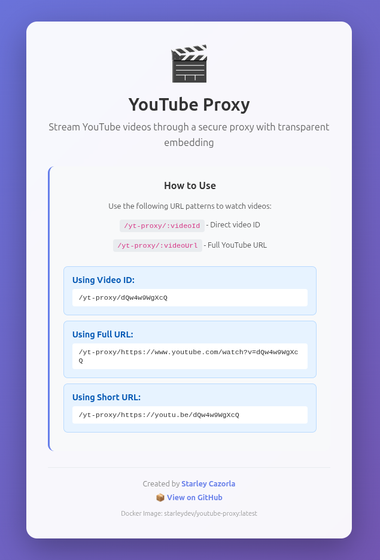

# YouTube Proxy

A simple YouTube proxy streaming application built with TypeScript and Express. This service allows you to embed YouTube videos through a proxy endpoint, supporting both video IDs and full YouTube URLs.

## Screenshot



## Features

- **Video ID Support**: Access videos directly using their YouTube video ID
- **Full URL Support**: Accept complete YouTube URLs and automatically extract the video ID
- **Multiple URL Formats**: Supports both `youtube.com` and `youtu.be` URL formats
- **Simple API**: Clean and straightforward REST API endpoints

## Installation

1. Clone the repository:

```bash
git clone https://github.com/starleyDev/youtube-proxy.git
cd youtube-proxy
```

2. Install dependencies:

```bash
npm install
```

## Usage

### Development Mode

Run the application with hot-reload enabled:

```bash
npm run dev
```

### Production Mode

Build and run the application:

```bash
npm start
```

The server will start on `http://localhost:3000`

### Docker Deployment

#### Using Docker Compose (Recommended for Casa OS)

```bash
docker-compose up -d
```

#### Build the Docker image

```bash
docker build -t youtube-proxy .
```

#### Run the container

```bash
docker run -p 3000:3000 youtube-proxy
```

#### Run in detached mode

```bash
docker run -d -p 3000:3000 --name youtube-proxy-server youtube-proxy
```

#### View logs

```bash
docker logs youtube-proxy-server
```

#### Stop the container

```bash
docker stop youtube-proxy-server
```

### Casa OS Deployment

#### Method 1: Using Docker Compose

1. Upload the project files to your Casa OS server
2. Navigate to the project directory
3. Run:

```bash
docker-compose up -d
```

4. Access the service at `http://<your-casa-os-ip>:3000`

#### Method 2: Using Casa OS Web UI

1. Open Casa OS dashboard
2. Go to **App Store** → **Docker Compose**
3. Click **Create** and paste the `docker-compose.yml` content
4. Deploy the application
5. Access via Casa OS services panel

## API Endpoints

### GET `/`

Returns a welcome page with usage instructions and examples.

**Response:**

```html
Welcome to Youtube Proxy! Use /yt-proxy/:videoId or /yt-proxy/:videoUrl to watch
a video.
```

### GET `/yt-proxy/:videoIdOrUrl`

Proxy endpoint for embedding YouTube videos.

**Parameters:**

- `videoIdOrUrl` (required): Either a YouTube video ID or full YouTube URL

**Supported URL Formats:**

- Video ID: `dQw4w9WgXcQ`
- YouTube URL: `https://www.youtube.com/watch?v=dQw4w9WgXcQ`
- Short URL: `https://youtu.be/dQw4w9WgXcQ`

**Response:**
Returns an HTML page with an embedded YouTube video iframe.

**Examples:**

```bash
# Using video ID
curl http://localhost:3000/yt-proxy/dQw4w9WgXcQ

# Using full URL
curl http://localhost:3000/yt-proxy/https://www.youtube.com/watch?v=dQw4w9WgXcQ

# Using short URL
curl http://localhost:3000/yt-proxy/https://youtu.be/dQw4w9WgXcQ
```

## Development

### Project Structure

```
youtube-proxy/
├── src/
│   └── index.ts       # Main application entry point
├── package.json       # Project dependencies and scripts
├── tsconfig.json      # TypeScript configuration
└── README.md          # This file
```

### Scripts

- `npm start` - Run the compiled JavaScript version
- `npm run dev` - Run with TypeScript and hot-reload using nodemon

### Technologies

- **TypeScript** - Type-safe JavaScript
- **Express** - Web framework
- **nodemon** - Development tool with auto-reload
- **ts-node** - TypeScript execution environment

## Author

**Starley Cazorla**

- GitHub: [@starleyDev](https://github.com/starleyDev)

## License

This project is licensed under the MIT License - see the [LICENSE](LICENSE) file for details.
